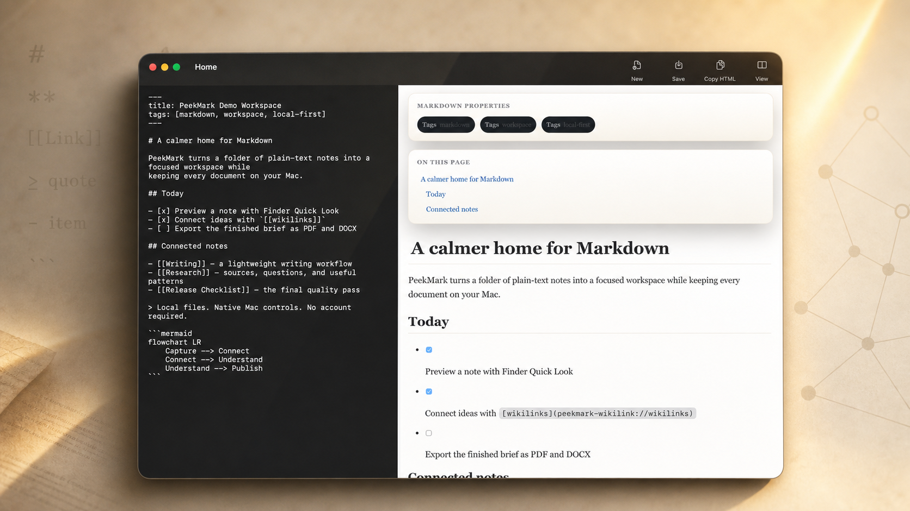

<p align="center">
  
</p>

<h1 align="center">PeekMark — Markdown preview that belongs on your Mac.</h1>

<p align="center">
  Press <strong>Space</strong> in Finder to preview Markdown with Mermaid, Math/LaTeX, code highlighting, tables, wikilinks, and local-only rendering.
</p>

<p align="center">
  <a href="https://peekmark.quartz.ink/playground"></a>
  <a href="https://peekmark.quartz.ink/"></a>
  <a href="https://github.com/QuartzInkStudio/PeekMark/releases/download/v1.0.0/PeekMark-1.0.0.dmg"></a>
</p>

```bash
brew install --cask QuartzInkStudio/tap/peekmark
```

<p align="center">
  
</p>

> Free and open source. Native Swift, no Electron, no subscription, and no remote document rendering.

## Open Core

| Edition | License | How to get |
|---------|---------|-----------|
| **Community** (free) | AGPL-3.0 | Build from source or download signed binary |
| **Pro** (paid) | Proprietary | Advanced workflow features, coming later |

> The Community edition is fully open source. Pro modules are proprietary and
> distributed only in official signed binaries.

## Features (Community)

- ✅ Quick Look extension — render `.md` in Finder (Space bar)
- ✅ GitHub-flavored Markdown (GFM)
- ✅ Syntax highlighting (highlight.js)
- ✅ Frontmatter, table of contents, heading anchors, and wikilinks
- ✅ Mermaid diagrams
- ✅ Math / LaTeX rendering
- ✅ Auto light / dark mode
- ✅ System font (SF Pro + SF Mono)
- ✅ Zero remote requests — works offline
- ✅ Menu bar scratchpad and global hotkey

## Planned Features (Pro)

- Workspace / vault browsing
- Backlinks, graph view, and link intelligence
- Advanced document search
- Custom themes and theme editor
- PDF / DOCX / HTML export
- Scratchpad history and quick-capture workflows

Pro code is not included in this repository. Official signed binaries may include
closed-source Pro modules loaded behind compile-time flags and license checks.

## Build from Source

Requires macOS 14+, Xcode 16+.

```bash
git clone https://github.com/QuartzInkStudio/PeekMark.git
cd PeekMark
open PeekMark.xcodeproj
```

Build the `PeekMark` scheme. The Quick Look extension is included.

## Verify Quick Look Locally

Quick Look extensions must be embedded in a signed app bundle before Finder can
load them reliably. After building or exporting PeekMark, run:

```bash
scripts/verify-quicklook.sh /path/to/PeekMark.app /path/to/sample.md
```

The script verifies code signatures, registers the app with Launch Services,
resets Quick Look cache, and opens a sample preview with `qlmanage -p`.

## Open Source Safety

Safe to commit:

- Source code under `QuickMarkApp`, `QuickMarkCore`, and `QuickMarkQL`
- `project.yml`, `PeekMark.xcodeproj`, `scripts/*.sh`, CI workflows, docs
- Public identifiers such as bundle IDs and public Sparkle update URLs
- Sparkle **public** EdDSA key (`SUPublicEDKey`) when configured

Never commit:

- App Store Connect API keys (`AuthKey_*.p8`), Key ID/Issuer ID secret config files
- Apple ID, app-specific passwords, notarytool keychain profile exports
- Developer ID certificates, `.p12`, `.cer`, provisioning profiles, private xcconfig files
- Sparkle EdDSA private key or any generated release DMG/archive artifacts

Keep release credentials in your local shell/keychain or GitHub Actions secrets.

## Pro Architecture

Pro implementation lives outside this public repository in a private Swift
Package. See [docs/PRO-ARCHITECTURE.md](docs/PRO-ARCHITECTURE.md).

## License

Community edition: [AGPL-3.0](LICENSE)  
Pro modules: Proprietary — see [LICENSE-PRO](LICENSE-PRO)

### Contributing

By submitting a pull request you agree to the [Contributor License Agreement](CLA.md).
This allows the project to be dual-licensed (AGPL community + proprietary Pro).
